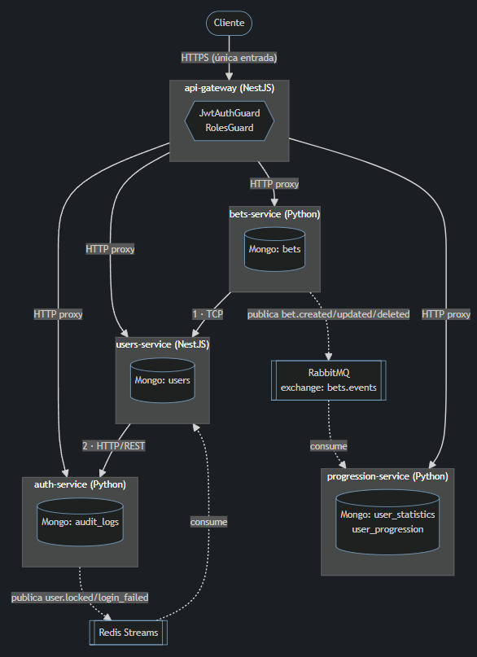
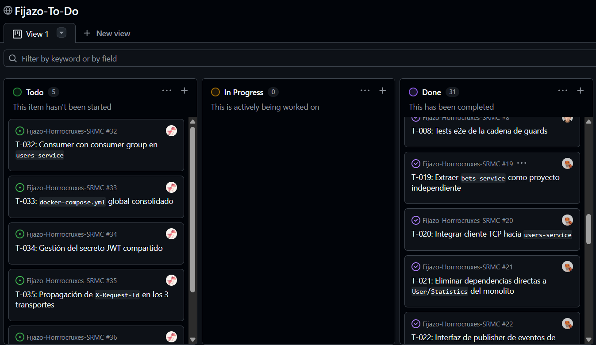

# Fijazo API


API para gestionar apuestas deportivas y llevar un registro personal del historial de apuestas
de cada usuario. MVP de arquitectura de microservicios centrado en **autenticación de usuarios** y **gestión de apuestas**.

## Equipo
| Integrante | Rol | GitHub |
|---|---|---|
| Carlos Hernández | Backend & Arquitectura | @gomiiDev |
| Olivier Paspuel | Transportes TCP & RabbitMQ | @vieerr |
| Antonio Revilla | Seguridad & Observabilidad | @RevillaA |
| Frederick Tipán | Documentación & Integración | @devdiagon |

## Descripción del MVP
El sistema gestiona apuestas deportivas y el progreso/historial de cada usuario, migrado desde un monolito hacia una arquitectura de microservicios independientes por dominio. Cada servicio es dueño de su propia base de datos y se comunica con los demás vía transporte síncrono (HTTP/TCP) para consistencia inmediata, y asíncrono (Redis Streams/RabbitMQ) para eventos que no deben bloquear al usuario.
- **auth-service (FastAPI):** credenciales, login/registro, emisión de JWT, bloqueo de cuenta por intentos fallidos, auditoría de seguridad.
- **users-service (NestJS):** dominio de usuarios (perfil, roles, activación/desactivación), expone validación de usuario por TCP para bets-service.
- **bets-service (FastAPI):** apuestas simples y parlays (CRUD), cálculo de cuotas combinadas/retorno potencial, import/export Excel.
- **progression-service (FastAPI):** estadísticas, rachas, logros y ranking derivados de las apuestas de cada usuario.
- **API Gateway (NestJS):** punto único de entrada, valida JWT y hace proxy por prefijo de ruta hacia cada microservicio.

## Stack
- **Framework:** FastAPI (auth, bets, progression) · NestJS (api-gateway, users)
- **Síncrono:** TCP (bets-service → users-service) y HTTP (gateway → servicios, users-service → auth-service) · **Eventos:** Redis Streams (auth-service>`security-events`) · **2.º transporte:** RabbitMQ (exchange>`bets.events` → cola `progression.recalc`) · **Contrato:** Schemas compartidos.
- **Seguridad:** JWT (PyJWT) + `JwtAuthGuard`/`RolesGuard` en el gateway · **Observabilidad:** Sentry
- **BD:** MongoDB (una base por servicio) · **Contenedores:** Docker Compose · **Estructura:** repo maestro con submódulos git por microservicio

## Cómo ejecutar
```bash
# POR DEFINIR
```

## Arquitectura



## Metodología
- **Kanban:** [GitHub Projects del equipo](https://github.com/orgs/Saint-Roche-Microsystems/projects/1/views/1)


- **Ramificación:** GitHub Flow — `main` protegida, ramas `feat/…`/`fix/…`, PRs revisados, tags por avance.
- **Commits semánticos:** Conventional Commits.

## Patrones y principios aplicados
- **API Gateway / Proxy:** el gateway centraliza autenticación y enruta por prefijo hacia cada microservicio (patrón propio sobre NestJS).
- **Publisher/Subscriber:** bets-service publica eventos de dominio a RabbitMQ; auth-service publica eventos de seguridad a Redis Streams.
- **Repository Pattern:** acceso a MongoDB encapsulado por repositorio en los servicios FastAPI.
- **DIP / Guards:** `JwtAuthGuard` y `RolesGuard` de Nest para autorización declarativa (`@Public()`, `@Roles()`).
- **Fail-open en eventos:** la publicación a Redis no bloquea el login si Redis falla (resiliencia sobre disponibilidad estricta).

---