# Fijazo API


API para gestionar apuestas deportivas y llevar un registro personal del historial de apuestas
de cada usuario. MVP de arquitectura de microservicios centrado en **autenticación de usuarios** y **gestión de apuestas**.

## Equipo
| Integrante | Rol | GitHub |
|---|---|---|
| Carlos Hernández | Backend & Arquitectura | @gomiiDev |
| Olivier Paspuel | Transportes TCP & RabbitMQ | @vieerr |
| Antonio Revilla | Seguridad & Observabilidad | @RevillaA |
| Frederick Tipán | Documentación & Integración | @devdiagon |

## Descripción del MVP
El sistema gestiona apuestas deportivas y el progreso/historial de cada usuario, migrado desde un monolito hacia una arquitectura de microservicios independientes por dominio. Cada servicio es dueño de su propia base de datos y se comunica con los demás vía transporte síncrono (HTTP/TCP) para consistencia inmediata, y asíncrono (Redis Streams/RabbitMQ) para eventos que no deben bloquear al usuario.
- **auth-service (FastAPI):** credenciales, login/registro, emisión de JWT, bloqueo de cuenta por intentos fallidos, auditoría de seguridad.
- **users-service (NestJS):** dominio de usuarios (perfil, roles, activación/desactivación), expone validación de usuario por TCP para bets-service.
- **bets-service (FastAPI):** apuestas simples y parlays (CRUD), cálculo de cuotas combinadas/retorno potencial, import/export Excel.
- **progression-service (FastAPI):** estadísticas, rachas, logros y ranking derivados de las apuestas de cada usuario.
- **API Gateway (NestJS):** punto único de entrada, valida JWT y hace proxy por prefijo de ruta hacia cada microservicio.
- **[fijazo](https://github.com/Saint-Roche-Microsystems/Fijazo-Frontend) (React + TypeScript + Vite):** frontend, consume exclusivamente el api-gateway.

## Stack
- **Framework:** FastAPI (auth, bets, progression) · NestJS (api-gateway, users)
- **Síncrono:** TCP (bets-service → users-service) y HTTP (gateway → servicios, users-service → auth-service) · **Eventos:** Redis Streams (auth-service>`security-events`) · **2.º transporte:** RabbitMQ (exchange>`bets.events` → cola `progression.recalc`) · **Contrato:** Schemas compartidos.
- **Seguridad:** JWT (PyJWT) + `JwtAuthGuard`/`RolesGuard` en el gateway · **Observabilidad:** Sentry
- **BD:** MongoDB (una base por servicio) · **Contenedores:** Docker Compose · **Estructura:** repo maestro con submódulos git por microservicio (y por el frontend)

## Cómo ejecutar

### Preparación

```bash
node scripts/bootstrap.mjs
```

Verifica que se encuentren las dependencias necesarias: `node`, `npm` y `poetry`, sincroniza los submódulos si falta alguno y genera el `.env` de cada microservicio. Finalmente instala las dependencias de cada microservicio.

### Para producción

```bash
docker compose up --build -d
```

Levanta todo el sistema, contenerizadas en imagenes de docker con el único puerto público: `3000` (api-gateway).

### Frontend

```bash
cd fijazo
cp .env.example .env   # VITE_API_URL apunta al api-gateway (http://localhost:3000)
npm install
npm run dev            # http://localhost:5173
```

El api-gateway debe tener `http://localhost:5173` en su `CORS_ORIGINS` (ya viene así por defecto
en `api-gateway/.env.example`). Ver [fijazo/README.md](fijazo/README.md) para despliegue en Vercel.

### Ejecutar en desarrollo

```bash
node scripts/local_run.mjs
```

Imprime, servicio por servicio, la secuencia exacta para levantarlo a mano en su propia terminal.

### Tests

Cada microservicio tiene su propia suite, en su submódulo:

```bash
cd bets-service && poetry run pytest      # ídem auth-service, progression-service
cd users-service && npm test              # ídem api-gateway
```

Los tests que cruzan servicios viven en `tests-integration/` y necesitan los contenedores levantados:

```bash
docker compose -f tests-integration/docker-compose.yml up -d --build
poetry run pytest tests-integration/ -q
docker compose -f tests-integration/docker-compose.yml down -v
```

En la raíz ya no hay código de aplicación ni suite propia: el `pyproject.toml` de la raíz sólo sostiene el utillaje (`scripts/`, `tests-integration/`).

## Arquitectura

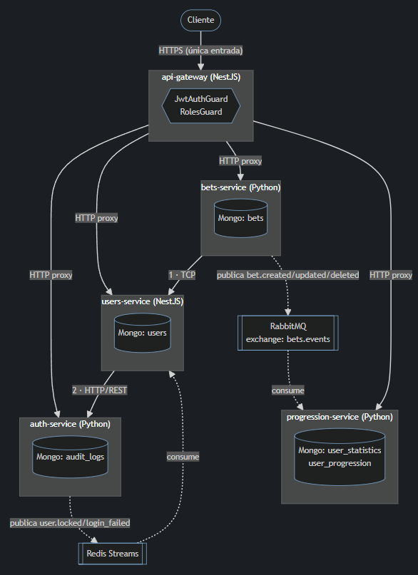

## Metodología
- **Kanban:** [GitHub Projects del equipo](https://github.com/orgs/Saint-Roche-Microsystems/projects/1/views/1)

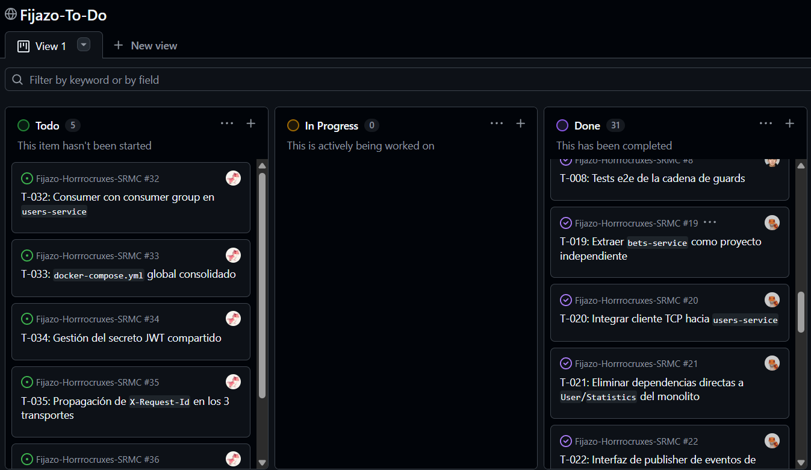
- **Ramificación:** GitHub Flow — `main` protegida, ramas `feat/…`/`fix/…`, PRs revisados, tags por avance.
- **Commits semánticos:** Conventional Commits.

## Patrones y principios aplicados
- **API Gateway / Proxy:** el gateway centraliza autenticación y enruta por prefijo hacia cada microservicio (patrón propio sobre NestJS).
- **Publisher/Subscriber:** bets-service publica eventos de dominio a RabbitMQ; auth-service publica eventos de seguridad a Redis Streams.
- **Repository Pattern:** acceso a MongoDB encapsulado por repositorio en los servicios FastAPI.
- **DIP / Guards:** `JwtAuthGuard` y `RolesGuard` de Nest para autorización declarativa (`@Public()`, `@Roles()`).
- **Fail-open en eventos:** la publicación a Redis no bloquea el login si Redis falla (resiliencia sobre disponibilidad estricta).

---

## 🟢 Avance 1 — Acoplamiento temporal y latencia · `tag v1-avance1`
### Caminos
- **Síncrono (TCP):** Gateway → **bets-service** → **users-service** (`users.validate`, cliente TCP contra el transporte `Transport.TCP` de Nest).
- **Asíncrono (Redis):** auth-service publica el evento de seguridad en el stream `security-events` (`XADD`); users-service lo consume con un consumer group (`XREADGROUP`) y marca `security_locked` en el perfil, sin bloquear al usuario que originó el evento.

### Latencia (con script personalizado `latency.mjs`)
| Camino | Promedio | p95 | Máximo |
|---|---|---|---|
| Síncrono (TCP) | 9.02 ms | 10.76 ms | 16.80 ms |
| Asíncrono (Redis) | 3.27 ms | 4.06 ms | 6.56 ms |

**Cómo ejecutarlo**: con `users-service` y `redis` levantados (`docker compose up -d`), correr `node scripts/latency.mjs` desde la raíz del repo, indicando un `user_id` real vía variable de entorno (`BENCH_USER_ID`). El script no tiene dependencias externas: habla el framing TCP de Nest (`<longitud>#<json>`) y el protocolo RESP de Redis directamente por socket (`node:net`), abre una conexión nueva por cada iteración y mide el round-trip hasta la respuesta/ACK. Por defecto corre 20 iteraciones de calentamiento + 200 mediciones por camino (`--iterations`/`--warmup` para ajustar) e imprime la tabla en Markdown lista para pegar aquí.

**Qué mide cada métrica**: **promedio** es el tiempo medio de respuesta por operación, útil como referencia general pero sensible a picos aislados; **p95** es el valor bajo el cual cae el 95% de las mediciones — el percentil que mejor describe la experiencia real bajo carga, ignorando el 5% de peores casos; **máximo** es el peor caso observado en la muestra, relevante para detectar colas de latencia (timeouts, GC pauses, contención) que el promedio oculta.

**Por qué un script propio y no benchmark.js**: benchmark.js está diseñado para *microbenchmarking* de funciones JavaScript puras en el mismo proceso (mide ops/segundo con corrección estadística de overhead de la propia librería), no para medir latencia de operaciones de red I/O-bound como un round-trip TCP o un `XADD` contra un proceso externo — no reporta percentiles como p95 de forma nativa, y su modelo de "ciclos de ejecución" no aplica a una llamada que pasa la mayor parte del tiempo esperando una respuesta por socket. Dado que lo que este proyecto necesita comparar es la latencia observable de dos protocolos de red distintos (no la velocidad de ejecución de código JS), un script mínimo sobre `node:net` que mide tiempos reales de round-trip y calcula percentiles a mano es más simple, más preciso para este caso de uso, y evita sumar una dependencia solo para volver a implementar el cálculo de percentiles por fuera de ella.

### Acoplamiento temporal
Al apagar **users-service**, cualquier `POST /bets` que dependa de `users.validate` falla de inmediato: `bets-service` abre una conexión TCP nueva por cada validación (sin capa de reconexión), por lo que el `ConnectionRefusedError` se propaga como `UserValidationUnavailableError` → **503** en la respuesta HTTP.

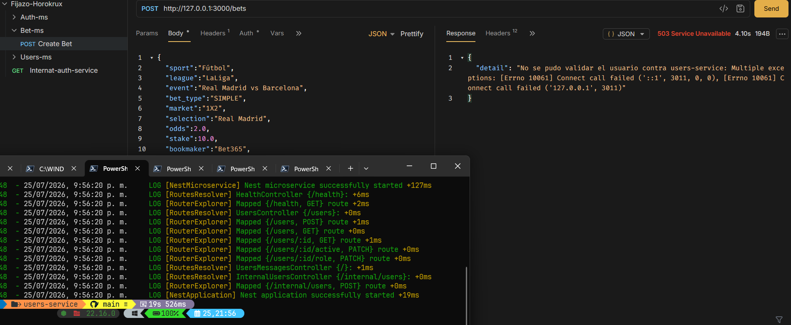

En la captura: el panel izquierdo confirma que `users-service` está caido, pero el `POST /bets` responde `503 Service Unavailable` con el detalle `"No se pudo validar el usuario contra users-service: ... Connect call failed ('127.0.0.1', 3011)"` — el fallo del vecino síncrono se refleja íntegramente en la respuesta al cliente.

El flujo asíncrono, en cambio, no depende de que el consumidor esté disponible en el instante de la publicación: el stream de Redis retiene el evento y `users-service` lo procesa al reactivarse, sin que el login que lo originó se haya visto afectado.

### Análisis
En el camino síncrono (TCP), la latencia total de la petición es la **suma** de los tiempos de cada salto: Gateway → bets-service → (TCP) users-service, y cada eslabón depende de que el anterior responda dentro de su timeout para poder continuar. Si un eslabón cae, el error se propaga hacia arriba y el cliente lo recibe en la misma petición (fail-closed): esto es **acoplamiento temporal** — el productor (bets-service) y el consumidor (users-service) deben estar activos **al mismo tiempo** para que la operación se complete. En el camino asíncrono (Redis Streams), auth-service y users-service no comparten ventana temporal: el productor persiste el evento y sigue, el consumidor lo procesa cuando puede, desacoplando la disponibilidad de ambos servicios del éxito de la operación original.

---

## 🟡 Avance 2 — Comunicación: HTTP/REST interno + 2.º transporte + excepciones · `tag v2-avance2`
### HTTP/REST interno (contrato)
**users-service → auth-service**: `GET /internal/lock-status/{user_id}`, disparado dentro del propio hop TCP `users.validate` (bets-service → users-service), como paso B→C de la cadena de validación de una apuesta. auth-service devuelve `{locked, locked_until, retry_after_seconds, failed_login_attempts, active}`. El contrato exige el secreto de servicio compartido `X-Internal-Key`: sin él (o con uno incorrecto) el router `/internal/*` de auth-service responde `401 Unauthorized` con `"Secreto de servicio inválido o ausente."`, aplicado a nivel de router para que ninguna ruta interna futura pueda olvidarse de la protección.

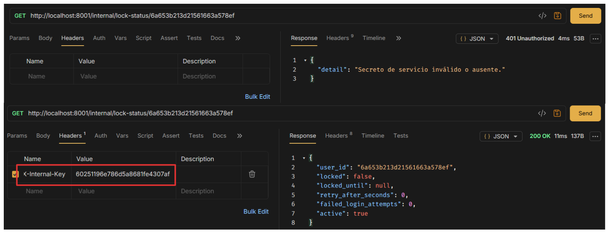

En la captura: la misma petición `GET /internal/lock-status/{id}` sin la cabecera `X-Internal-Key` responde `401`; con la cabecera correcta responde `200` con el estado real de bloqueo — el contrato exige el secreto en toda la superficie `/internal/*`, no solo en rutas puntuales.

El mismo `X-Request-Id` originado en la petición del gateway se propaga por las 4 patas de la cadena (gateway → TCP → HTTP interno → evento Redis/RabbitMQ), lo que permite correlacionar en logs una misma operación de negocio a través de procesos distintos:

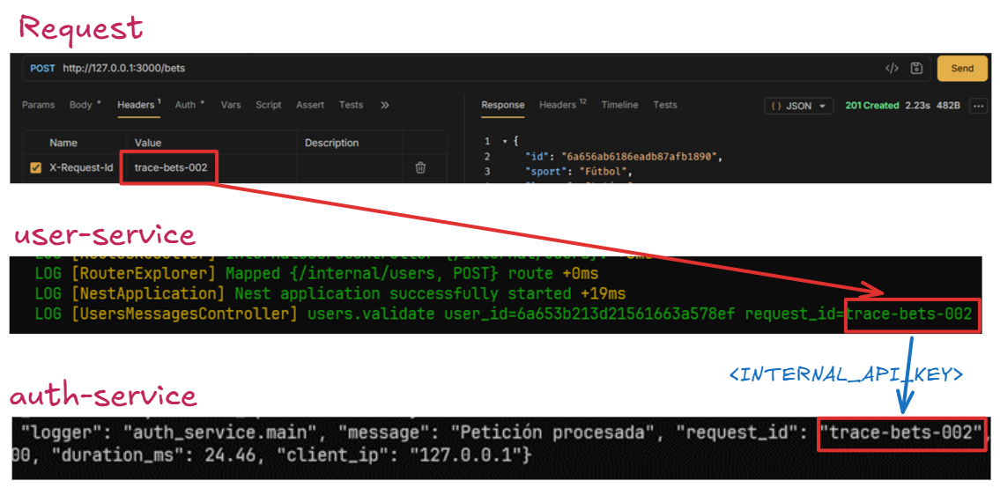

### Segundo transporte
Transporte elegido: **RabbitMQ** (exchange topic `bets.events`, cola `progression.recalc` con binding `bet.#`). Flujo tipo **queue con enrutado por topic**: cada mutación de apuesta (`bet.created`/`bet.updated`/`bet.deleted`) se publica en `bets-service` con routing key igual al tipo de evento, ya persistida la apuesta en Mongo — el evento es un anuncio de un hecho ya ocurrido, no parte de la transacción.

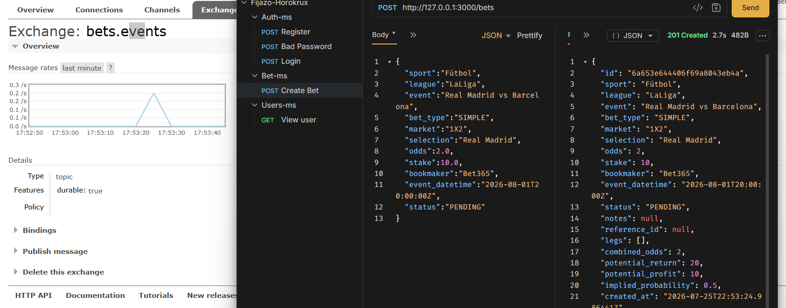

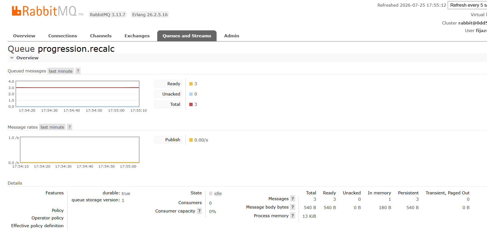

En la captura del exchange se ve el pico de tasa de mensajes en el momento del `POST /bets`, y el mensaje ya en la cola `progression.recalc` (`Ready: 3`, sin consumidores activos) — evidencia de que la publicación funciona de forma independiente de si hay o no un consumidor levantado del otro lado. Fue tomada antes de que existiera el consumer: hoy `progression-service` drena esa cola, y el desacople que muestra la captura sigue valiendo (si el consumidor se cae, los mensajes se acumulan y se procesan al volver).

El consumidor confirma cada mensaje sólo cuando el recálculo terminó (*at-least-once*), lo que es seguro porque recalcular es idempotente: el evento sólo dice **qué usuario** cambió y `progression-service` relee su historial completo. Si `bets-service` no responde, el mensaje vuelve a la cola en vez de descartarse — la alternativa dejaría la proyección obsoleta de forma permanente. El detalle de la política está en [progression-service/README.md](progression-service/README.md).

### Comparación de transportes
| Transporte | Tipo | Patrón | Uso en el proyecto |
|---|---|---|---|
| TCP | Síncrono | Petición-respuesta | `bets-service` → `users-service` (`users.validate`), valida al usuario antes de crear/actualizar una apuesta. |
| Redis | Asíncrono | PUB/SUB (Streams + consumer group) | `auth-service` → `users-service`, eventos de seguridad (`user.login_failed`/`user.locked`) que marcan `security_locked` en el perfil sin bloquear el login. |
| RabbitMQ | Asíncrono | Queue con enrutado por topic (exchange `bets.events` → cola `progression.recalc`) | `bets-service` anuncia mutaciones de apuesta para que `progression-service` recalcule estadísticas/rachas/logros. |
| HTTP/REST | Síncrono | Contrato/RPC | `api-gateway` → todos los servicios (proxy); `users-service` → `auth-service` (`/internal/lock-status/{id}`), consulta de estado de bloqueo dentro del hop TCP; `progression-service` → `bets-service` (`/internal/bets?user_id=`), relectura del historial para recalcular. |

TCP y HTTP/REST síncronos se usan cuando la respuesta debe reflejar el estado real **en el instante** de la petición (validar un usuario, consultar si está bloqueado antes de aceptar una apuesta): el costo es acoplamiento temporal y latencia acumulada, pero se gana consistencia inmediata. Redis Streams y RabbitMQ se usan cuando la acción disparadora no debe esperar a que el interesado la procese (notificar un bloqueo de cuenta, avisar que hay que recalcular progreso): se gana desacoplamiento y resiliencia ante caídas temporales del consumidor, a cambio de consistencia eventual.

### Manejo de excepciones
Se identificaron y evidenciaron dos mecanismos de control de errores con criterios opuestos, ambos con `try/except` que evitan que un fallo de infraestructura tumbe el servicio:

- **Fail-closed (TCP bets→users, ver Avance 1)**: `TcpUserValidator.validate()` captura `(asyncio.TimeoutError, OSError, ValueError)` y los traduce a `UserValidationUnavailableError` → **503** explícito en la respuesta HTTP. El error se comunica al cliente, no se oculta.
- **Fail-open (RabbitMQ, `BetService._publish`)**: la publicación del evento de dominio ocurre **después** de persistir la apuesta en Mongo, envuelta en `try/except Exception` que solo hace `logger.exception(...)`, sin revertir ni propagar. Para evidenciarlo sin apagar el contenedor completo de RabbitMQ (lo que activa la reconexión automática de `aio_pika.connect_robust` y oculta el error a nivel de aplicación), se forzó un error de protocolo eliminando el exchange `bets.events` en caliente:

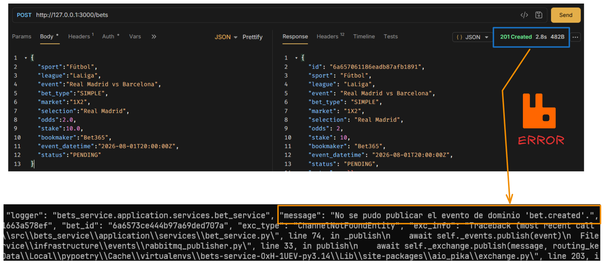

En la captura: el `POST /bets` sigue respondiendo `201 Created` con la apuesta persistida, mientras el log estructurado de `bets-service` registra `"No se pudo publicar el evento de dominio 'bet.created'."` (`exc_type: ChannelNotFoundEntity`) — el fallo del segundo transporte no afecta la respuesta al usuario ni la integridad del dato ya guardado, que es la fuente de verdad.

Mismo patrón fail-open aplica en `RedisSecurityEventPublisher.publish()` (auth-service) y en `AuthClient.getLockStatus()` (users-service → auth-service): ambos asumen el valor "seguro por defecto" (`locked: false`) ante un fallo de su dependencia, priorizando disponibilidad del login sobre bloqueo estricto — inconsistente con el criterio fail-closed que aplica bets-service en el mismo tipo de dependencia, documentado como gap pendiente de definición de criterio único.

Un tercer caso, **fail-closed por integridad del dato** (no por seguridad): `HttpBetRepository` (progression-service → bets-service) traduce cualquier fallo de la lectura a `BetSourceUnavailableError` → **503**, en vez de devolver una lista vacía. Aquí el "valor seguro por defecto" no existe: `StatisticsService.recalculate` hace `upsert` de lo que calcule, así que interpretar un fallo de red como "este usuario no tiene apuestas" sobrescribiría sus estadísticas reales con ceros — y esa proyección es la única copia. El criterio, entonces, no es "seguridad vs disponibilidad" sino **qué error es reversible**: no recalcular se arregla reintentando; recalcular con datos falsos, no.

---

## 🔵 Avance 3 — Seguridad, observabilidad e integración (FINAL) · `tag v3-final`
### Autenticación y autorización
`POST /auth/login` (auth-service, vía gateway) valida credenciales y emite un JWT (`access_token` + `token_type: bearer`). El gateway protege el resto de rutas con `JwtAuthGuard`: toda ruta que no esté marcada `@Public()` exige `Authorization: Bearer <token>` válido antes de dejar pasar el proxy hacia el microservicio destino; `RolesGuard` añade una capa adicional para rutas anotadas con `@Roles(...)`.

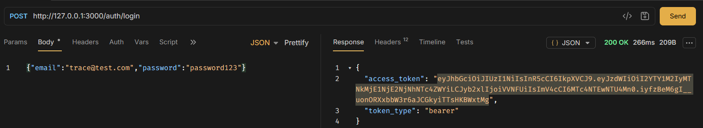

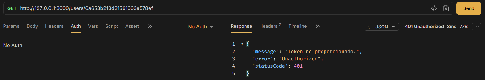

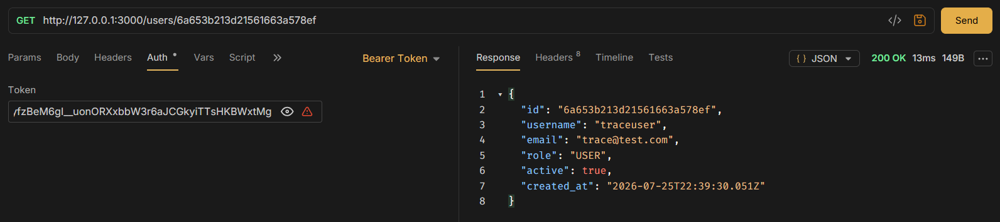

En las capturas: `POST /auth/login` devuelve el `access_token`; `GET /users/{id}` sin cabecera `Authorization` es rechazada por el `JwtAuthGuard` del gateway (`401`, `"Token no proporcionado."`) **antes** de llegar a hacer proxy hacia users-service; la misma petición con `Bearer <access_token>` pasa el guard y responde `200` con el perfil — el gateway es el único punto que valida el JWT, los microservicios internos confían en la identidad que llega resuelta por cabecera (`X-User-Id`, ver Avance 2) más el secreto de servicio (`X-Internal-Key`).

### Observabilidad (Sentry)
Los 5 microservicios (auth-service, bets-service, progression-service, users-service, api-gateway) inicializan Sentry de forma condicional a `SENTRY_DSN`: si la variable está vacía el SDK queda deshabilitado y el servicio arranca igual. Solo se reportan errores (`traces_sample_rate=0`, sin performance tracing) en dos categorías:

- **No controlados**: cualquier excepción que llegue al middleware de logging (FastAPI) o al filtro global de excepciones (NestJS) sin haber sido traducida antes a una respuesta de negocio (`domain_error_handler` / `status >= 500`).
- **Fail-open/fail-closed instrumentados a mano**: los puntos donde un servicio decide seguir adelante (o fallar) pese a un error de una dependencia.

Cada evento capturado lleva las mismas etiquetas en los 5 servicios: `service` (nombre del microservicio), `transport` (`http`/`tcp`/`redis`/`rabbitmq`), `failure_mode` (`fail-open`/`fail-closed`) y `request_id`.

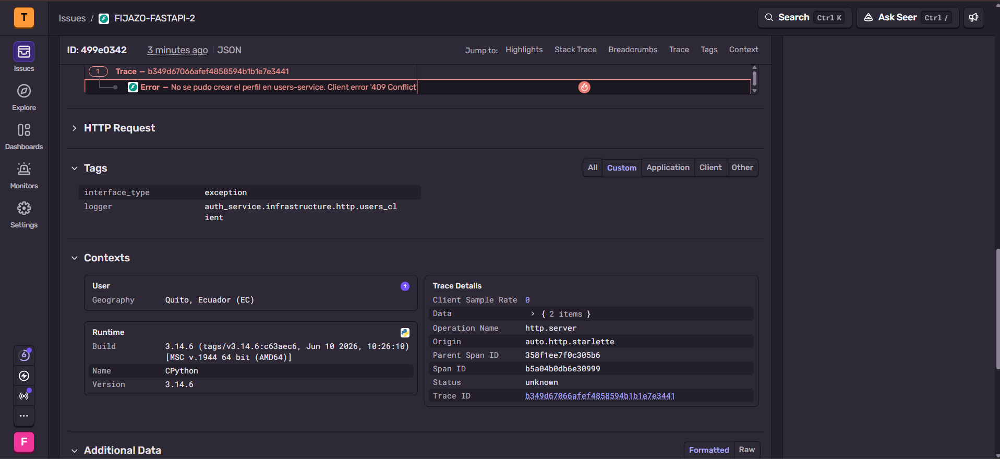

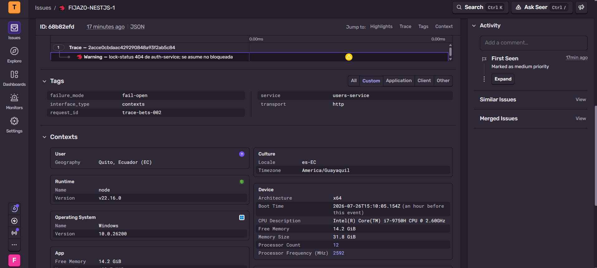

### Integración final
Operación que atraviesa el sistema completo, combinando los tres transportes documentados en los avances anteriores — desde que un usuario se autentica hasta que su apuesta impacta en su progreso:

1. `POST /auth/login` (gateway → auth-service): valida credenciales, emite JWT. Si falla 5 veces, auth-service publica `user.locked` en Redis Streams (asíncrono) y users-service marca `security_locked` en el perfil sin bloquear el login que lo originó.
2. `POST /bets` (gateway → bets-service), con `Authorization: Bearer <jwt>`: el `JwtAuthGuard` valida el token y el proxy inyecta `X-User-Id`/`X-Internal-Key`.
3. bets-service valida al usuario por **TCP** contra `users.validate` (users-service) — fail-closed, 503 si users-service no responde (Avance 1).
4. Dentro de ese mismo hop, users-service consulta por **HTTP interno** `/internal/lock-status/{id}` en auth-service — fail-open, asume no bloqueado si auth-service no responde (Avance 2).
5. Si el usuario es válido y no está bloqueado, bets-service persiste la apuesta en su Mongo (fuente de verdad) y responde `201` al cliente.
6. bets-service publica el evento `bet.created` en **RabbitMQ** (exchange `bets.events` → cola `progression.recalc`) — fail-open, un fallo de publicación no revierte la apuesta ya persistida (Avance 2).
7. El consumidor de `progression.recalc` en progression-service recibe el evento y recalcula estadísticas/rachas/logros de ese usuario: relee su historial completo por **HTTP interno** `GET /internal/bets?user_id=` en bets-service (fail-closed, 503 si no responde: recalcular con un historial vacío borraría las estadísticas buenas) y materializa el resultado en su propia base. El evento solo **avisa** de qué usuario cambió, no transporta la apuesta, así que reprocesarlo es idempotente. `POST /internal/recalculate/{user_id}` queda como disparo manual.

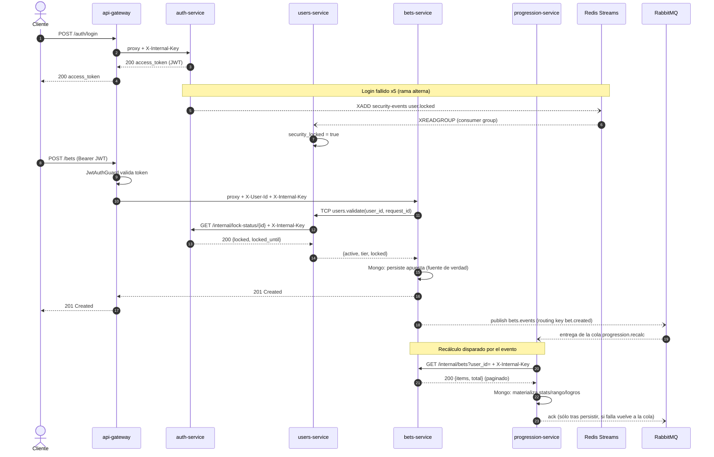
```mermaid
sequenceDiagram
    autonumber
    actor Cliente
    participant GW as api-gateway
    participant Auth as auth-service
    participant Users as users-service
    participant Bets as bets-service
    participant Prog as progression-service
    participant Redis as Redis Streams
    participant MQ as RabbitMQ

    Cliente->>GW: POST /auth/login
    GW->>Auth: proxy + X-Internal-Key
    Auth-->>GW: 200 access_token (JWT)
    GW-->>Cliente: 200 access_token

    Note over Auth,Redis: Login fallido x5 (rama alterna)
    Auth--)Redis: XADD security-events user.locked
    Redis--)Users: XREADGROUP (consumer group)
    Users->>Users: security_locked = true

    Cliente->>GW: POST /bets (Bearer JWT)
    GW->>GW: JwtAuthGuard valida token
    GW->>Bets: proxy + X-User-Id + X-Internal-Key
    Bets->>Users: TCP users.validate(user_id, request_id)
    Users->>Auth: GET /internal/lock-status/{id} + X-Internal-Key
    Auth-->>Users: 200 {locked, locked_until}
    Users-->>Bets: {active, tier, locked}
    Bets->>Bets: Mongo: persiste apuesta (fuente de verdad)
    Bets-->>GW: 201 Created
    GW-->>Cliente: 201 Created

    Bets--)MQ: publish bets.events (routing key bet.created)
    MQ--)Prog: entrega de la cola progression.recalc

    Note over Prog,Bets: Recálculo disparado por el evento
    Prog->>Bets: GET /internal/bets?user_id= + X-Internal-Key
    Bets-->>Prog: 200 {items, total} (paginado)
    Prog->>Prog: Mongo: materializa stats/rango/logros
    Prog--)MQ: ack (sólo tras persistir, si falla vuelve a la cola)
```

### Diagrama final

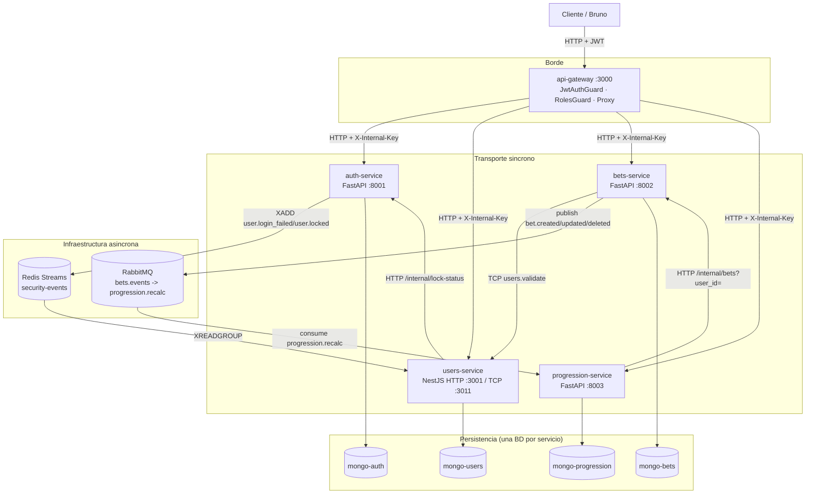
```mermaid
graph TB
    Cliente["Cliente / Bruno"]

    subgraph Edge["Borde"]
        GW["api-gateway :3000<br/>JwtAuthGuard · RolesGuard · Proxy"]
    end

    subgraph Sync["Transporte sincrono"]
        Auth["auth-service<br/>FastAPI :8001"]
        Users["users-service<br/>NestJS HTTP :3001 / TCP :3011"]
        Bets["bets-service<br/>FastAPI :8002"]
        Prog["progression-service<br/>FastAPI :8003"]
    end

    subgraph Async["Infraestructura asincrona"]
        Redis[("Redis Streams<br/>security-events")]
        MQ[("RabbitMQ<br/>bets.events -> progression.recalc")]
    end

    subgraph Data["Persistencia (una BD por servicio)"]
        MAuth[("mongo-auth")]
        MUsers[("mongo-users")]
        MBets[("mongo-bets")]
        MProg[("mongo-progression")]
    end

    Cliente -->|HTTP + JWT| GW
    GW -->|HTTP + X-Internal-Key| Auth
    GW -->|HTTP + X-Internal-Key| Users
    GW -->|HTTP + X-Internal-Key| Bets
    GW -->|HTTP + X-Internal-Key| Prog

    Bets -->|TCP users.validate| Users
    Users -->|HTTP /internal/lock-status| Auth
    Prog -->|HTTP /internal/bets?user_id=| Bets

    Auth -->|XADD user.login_failed/user.locked| Redis
    Redis -->|XREADGROUP| Users

    Bets -->|publish bet.created/updated/deleted| MQ
    MQ -->|consume progression.recalc| Prog

    Auth --> MAuth
    Users --> MUsers
    Bets --> MBets
    Prog --> MProg
```

---

## 🎤 Defensa
**Runbook de la demo:**
```
1. Levantar:            node scripts/bootstrap.mjs (una vez) -> docker compose up --build -d
                         (o node scripts/local_run.mjs para verlo servicio por servicio)
2. Ver servicios:       docker compose ps / GET http://localhost:3000/health
3. Login:               POST http://localhost:3000/auth/login -> devuelve access_token
4. Ruta protegida:      GET http://localhost:3000/users/{id} sin token -> 401
                         con Authorization: Bearer <access_token> -> 200 (JwtAuthGuard en acción)
5. Operación integrada: POST http://localhost:3000/bets con JWT -> TCP a users-service
                         (users.validate), HTTP interno users-service -> auth-service
                         (lock-status), persistencia en Mongo y evento a RabbitMQ (bet.created)
6. Provocar un error   -> mostrarlo capturado en el panel de Sentry
   (p. ej.: apagar RabbitMQ y hacer POST /bets -> ver el evento)
```

**Preguntas probables del jurado:**
- ¿Qué información viaja dentro de un JWT y cómo se valida?
- ¿Qué hace un Guard en NestJS y en qué se diferencia de un middleware?
- ¿Cuál es la diferencia entre autenticación y autorización?
- ¿Por qué eligieron HTTP/REST para ese salto y no TCP/eventos?
- ¿En qué se diferencian los transportes que usaron (TCP, Redis, RabbitMQ, HTTP/REST)?
- ¿Para qué sirve Sentry y qué registran ahí?
- ¿Por qué usar dos tecnologías diferentes para los microservicios?
- ¿Cuál fué el motivo para que cada microservicio tenga su propia DB?
- ¿Por qué Redis Streams para eventos de seguridad y RabbitMQ para eventos de apuestas, en vez de un solo broker?
- ¿Qué pasa si Sentry no tiene DSN configurado?

---

## 🏷️ Tags de entrega
- `v1-avance1` — 23/07/2026 · `v2-avance2` — 23/07/2026 · `v3-final` — 26/07/2026