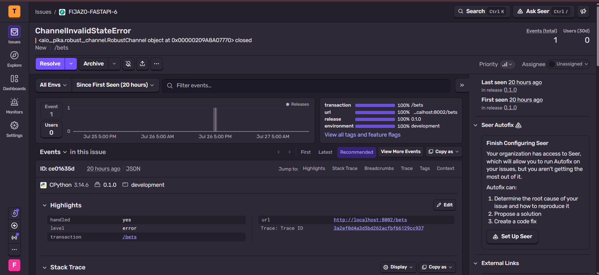
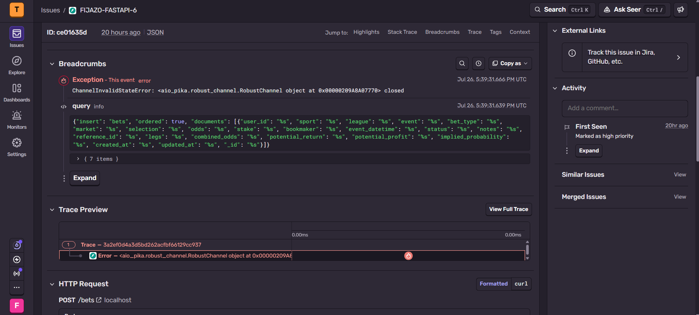
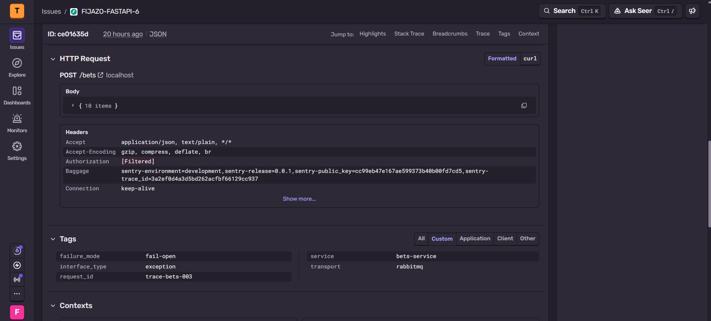
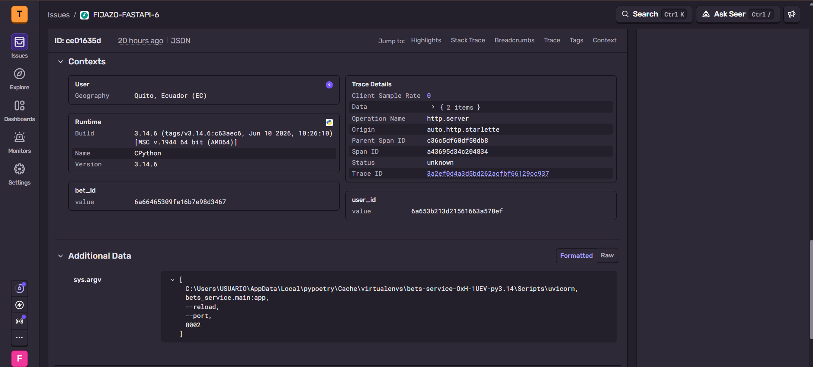
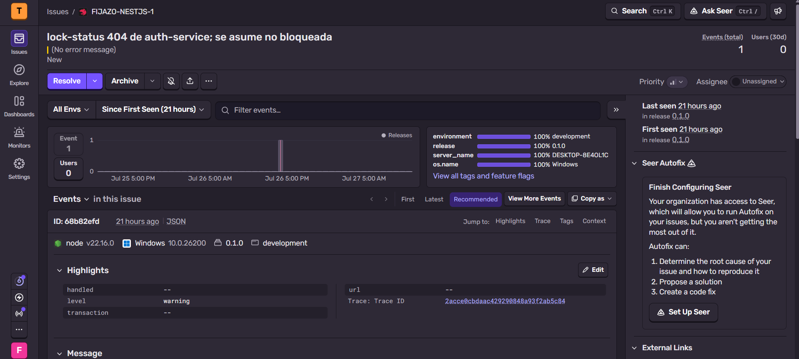
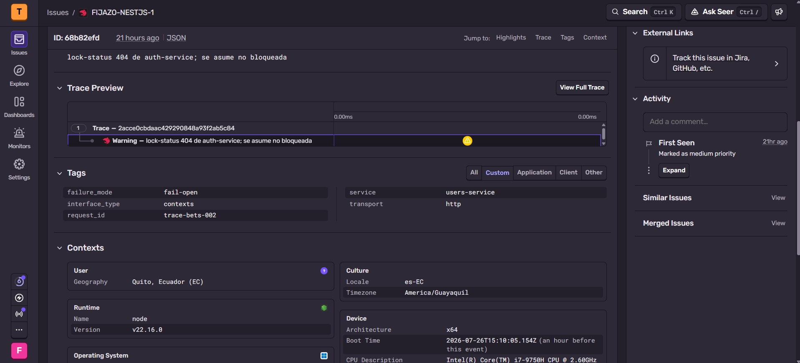
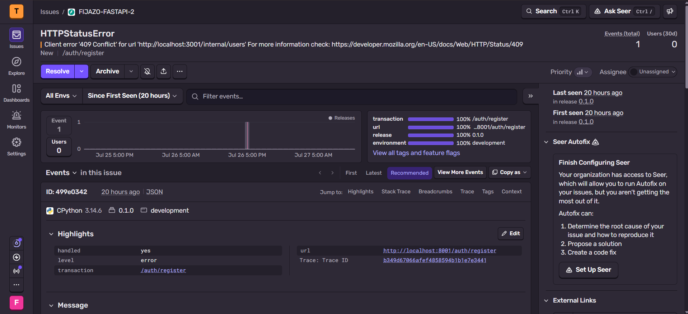
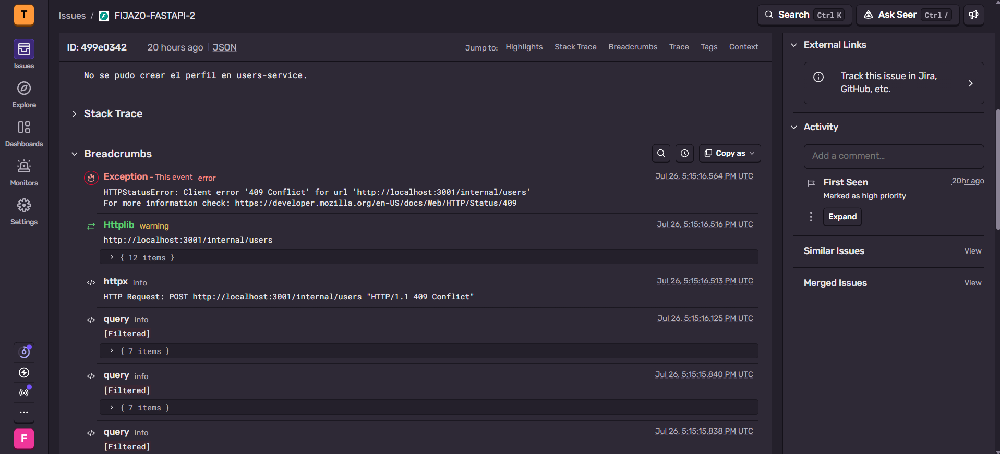
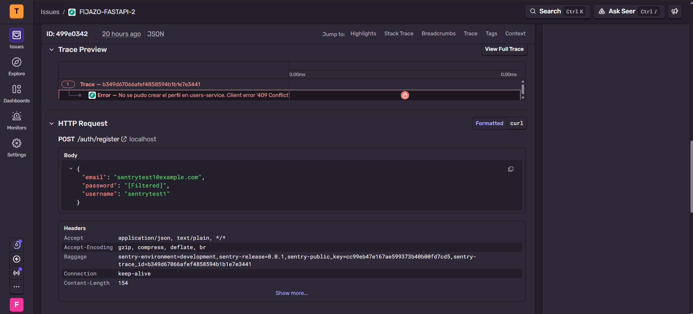
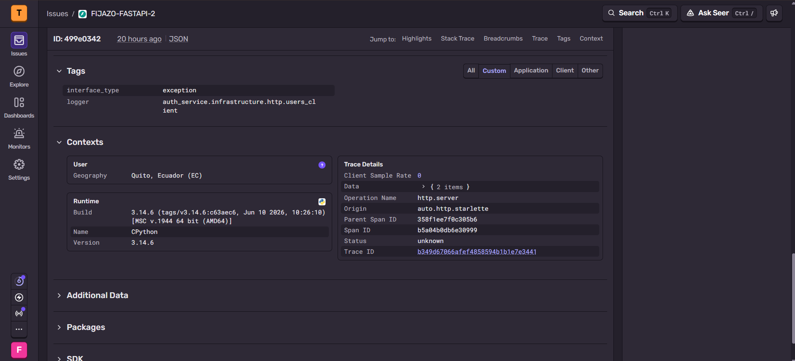

# Bitácora — Examen Final

---

## 0. Identificación

| | |
|---|---|
| **Nombre** | Frederick Tipán |
| **Usuario GitHub** | @devdiagon |
| **Grupo / Proyecto** | Grupo 1 - Fijazo API |
| **Actividad asignada** | *(letra y nombre, tal como aparece en `ASIGNACION.md`)* |
| **Rama** | `exam/devdiagon` |
| **Tag** | `examen-devdiagon` |
| **Pull Request** | [enlace]() |
| **Tarjeta Kanban** | [enlace]() |
| **¿Hiciste el Paso 0?** | No — [Evidencia](https://github.com/Saint-Roche-Microsystems/Auth-Service/blob/70f8eece632aa3405f3ae67272ad293d7a2d2416/src/auth_service/core/security.py) |

---

## 1. Qué construí

Variante de tema (D) ya implementado anteriormente dentro del proyecto.

---

## 2. Anclaje con el repositorio de mi grupo — **obligatorio (C2)**

Únicamente se modifica el README dentro de la misma rama para documentar las evidencias.

---

## 3. Decisiones técnicas

Decisiones ya tomadas con anterioridad, revisar el BITACORA.md sobre la conveción de tags para `failure_mode`.

---

## 4. Las 3 preguntas de mi actividad

**Pregunta 1: ¿Por qué la inicialización debe ser no-op cuando no hay DSN en vez de fallar al arrancar?**

> Porque Sentry es un un componente transversal de observabilidad, no se trata de una dependencia directa crítica para que deba operar un servicio. Si se lo acoplara directamente dentro del código, configurar el DSN de Sentry se convierte en una dependencia fuerte para arrancar un servicio, lo cual obstruiría con el desarrollo y pruebas automatizadas.

**Pregunta 2: ¿Qué información nunca debe llegar a Sentry desde un sistema con datos de usuarios, y qué hiciste concretamente para impedirlo?**

> Dado que sentry se encarga de registrar metadatos de error, los datos que NO deben exponerse deben ser PII de usuarios: emails, contraseñas (aunque estén hasheadas), tokens JWT, cookies de sesión, y cualquier identificador que permita re-vincular a una persona real fuera del propio sistema.

> Para ello se realizaron varias configuraciones:
>- **A nivel SDK:** send_default_pii=False en init_sentry (FastAPI). Esto desactiva la captura automática que Sentry hace por defecto de headers de request, cookies, IP del cliente y datos de usuario autenticado.
>- **A nivel convención de tags:** user_id nunca es tag, siempre va como contexto extra (al declararlo como scope.set_context). Mantener user_id fuera de los tags evita que Sentry se convierta en una herramienta de búsqueda de usuarios por PII.

**Pregunta 3: ¿Qué diferencia hay entre un tag y un contexto en Sentry, y por qué elegiste precisamente esos tags?**

> Un `tag` es un par clave-valor que Sentry lo puede indexar, permitiendo usarlo para filtrar, agrupar y armar breakdowns en el dashboard. Mientras que el `contexto` no se indexa, ya que está pensado estríctamente para dar un detalle explicativo de un evento puntual que se está analizando.

>A continuación se detallan los tags personalizados, junto con su justificación de uso:
> - `service`: cuál de los 5 microservicios generó el evento.
>- `transport`: cuál canal falló -> http, tcp, redis, rabbitmq; esto porque cada canal tiene un modo de falla distinto y requiere una respuesta operativa distinta.
>- `failure_mode`: 'fail-open' vs 'fail-closed', dado que existe acoplamientos entre varios servicios, pueden llegar a ocurrir eventos que al usuario se lo presentan como correctos, pero por detrás otros servicios pueden fallar silenciosamente.
>- `request_id`: para correlacionar el evento de Sentry con los logs estructurados y la traza de X-Request-Id que se propaga entre los microservicios; esto permite revisar eficientemente el error dentro de los logs correspondientes.

---

## 5. Uso de Inteligencia Artificial — **obligatorio**

**¿Usaste IA en este examen?**  ☒ Sí  ☐ No

| # | Qué le pedí | Qué me devolvió | Qué corregí, adapté o descarté — y por qué |
|:--:|---|---|---|
| 1 | Agrega las capturas de evidencia correspondientes halladas en docs/examen/devdiagon/img/ dentro de BITACORA.md |  | |

> Nota: La IA ya contaba previamente con el contexto suficiente sobre el dominio y convenciones del proyecto. Por lo que en sesiones futuras no alucianaba con resultados aleatorios respecto a la convención ya implementada.

---

## 6. Evidencia

### Errores capturados con tags

**Conjunto 1 — `sentry_fastapi` (bets-service, fail-closed vía `capture_error`)**
`ChannelInvalidStateError` al publicar en RabbitMQ desde `POST /bets`: el canal de `aio_pika` se cerró a mitad de la operación. Se ve el breadcrumb con el documento del bet que se intentaba insertar y el trace completo (`FIJAZO-FASTAPI-6`, 1 evento, release `0.1.0`).









**Conjunto 3 — `sentry_nestjs` (users-service, fail-open vía `capture_error`)**
Warning `lock-status 404 de auth-service; se asume no bloqueada`: `AuthClient.getLockStatus` no encuentra el estado de bloqueo (404) y el consumer asume `locked: false` por defecto. Acá sí se ven los tags propios en la pestaña **Tags**: `service=users-service`, `transport=http`, `failure_mode=fail-open`, `request_id=trace-bets-002` (`FIJAZO-NESTJS-1`, 1 evento, prioridad media).





### Errores capturados por SDK

**Conjunto 2 — `sentry_fastapi_automatic_sdk` (auth-service, 7º punto fail-open no inventariado)**
`HTTPStatusError` (409 Conflict) al llamar a `POST /internal/users` desde `HttpUsersClient.create_profile` durante `auth/register`: users-service ya tenía el perfil creado. El evento llega vía `logger.exception()` capturado por la `LoggingIntegration` automática de Sentry, no por `capture_error()` — de ahí que no tenga los tags propios (`service`/`transport`/`failure_mode`), solo los defaults del SDK (`FIJAZO-FASTAPI-2`, 1 evento).










### Cómo reproducir mi cambio desde cero

```bash
# Levantar toda la plataforma (gateway + 4 microservicios + Mongo x4 + Redis + RabbitMQ)
docker compose up -d --build

# Registrar un usuario y loguearse para obtener el token (todo vía gateway, puerto 3000)
curl -s -X POST localhost:3000/auth/register \
  -H "Content-Type: application/json" \
  -d '{"username":"demo_qa","email":"demo_qa@example.com","password":"Passw0rd!"}'

TOKEN=$(curl -s -X POST localhost:3000/auth/login \
  -H "Content-Type: application/json" \
  -d '{"username":"demo_qa","password":"Passw0rd!"}' | jq -r .access_token)
```

**Caso 1 — RabbitMQ caído → `ChannelInvalidStateError` fail-closed en bets-service**

```bash
# Tumbar RabbitMQ mientras bets-service ya tiene un canal abierto contra él
docker compose stop rabbitmq

# Crear una apuesta: el insert en Mongo se completa, pero al publicar el evento
# bet.created el canal de aio_pika ya está cerrado -> capture_error(fail-closed, transport=rabbitmq)
curl -s -X POST localhost:3000/bets \
  -H "Authorization: Bearer $TOKEN" -H "Content-Type: application/json" \
  -d '{"sport":"football","league":"LigaPro","event":"Barcelona vs Emelec","bet_type":"1x2","market":"resultado","selection":"local","odds":1.85,"stake":10,"bookmaker":"demo"}'

docker compose start rabbitmq   # restaurar el entorno
```

**Caso 2 — credencial borrada de auth-service → `lock-status 404` fail-open en users-service**

```bash
# Con el usuario ya registrado y logueado, tomar su id (mismo _id en auth y en users)
USER_ID=$(curl -s localhost:3000/users/me -H "Authorization: Bearer $TOKEN" | jq -r ._id)

# Borrar directamente su credencial en la base de auth-service (mongo-auth, puerto 27019)
mongosh mongodb://localhost:27019/auth_db --quiet \
  --eval "db.credentials.deleteOne({_id: ObjectId('$USER_ID')})"

# Crear una apuesta con el mismo token: bets-service valida por TCP contra users-service
# (users.validate), que a su vez consulta GET /internal/lock-status/{id} en auth-service.
# Como la credencial ya no existe, auth-service responde 404 y AuthClient.getLockStatus
# lo captura como fail-open (asume locked:false) -> capture_error(transport=http,
# failure_mode=fail-open) en users-service, y la apuesta se crea igual.
curl -s -X POST localhost:3000/bets \
  -H "Authorization: Bearer $TOKEN" -H "Content-Type: application/json" \
  -d '{"sport":"football","league":"LigaPro","event":"Barcelona vs Emelec","bet_type":"1x2","market":"resultado","selection":"local","odds":1.85,"stake":10,"bookmaker":"demo"}'
```

Ambos casos se revisan en el panel de Sentry del proyecto correspondiente (FastAPI para el Caso 1, NestJS para el Caso 2) — ver capturas en la sección de Evidencia.

---

## 7. Prueba automatizada

No aplica, se tiene que causar la exepción de forma manual e intencionada.

---

## 8. Estado final — honesto

**Funciona:**  Mediante las capturas se evidencia la aplicación de tags ante fallos esperados dentro del código mediante el `capture_error()`. De la misma manera se evidencia fallos inesperados receptados por el proio SDK, lo que a futuro permite tomarlo en consideración para reforzar el mecanismo de observabilidad.

---

## 9. Declaración

> Declaro que este trabajo es individual, que corresponde a la actividad que me fue asignada, y que la sección 5 refleja de forma completa y veraz el uso que hice de herramientas de Inteligencia Artificial durante el examen.

**Nombre:** Frederick Tipán

**Fecha:** 27/07/2026
